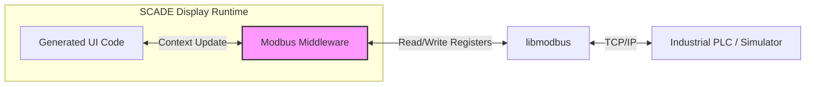

# Ansys SCADE Display Modbus Middleware


## 🏭 Architectural Overview
This repository provides a robust **Middleware Layer** that extends the capabilities of **Ansys SCADE Display**, enabling generated Human-Machine Interfaces (HMIs) to communicate natively with Industrial Automation Systems (PLCs, RTUs) via **Modbus TCP/IP**.

While SCADE Display excels at safety-critical UI generation, native fieldbus integration can be limited. This library bridges that gap, allowing for seamless, low-latency state synchronization between the UI loop and the control network.

### System Integration Diagram
The middleware sits between the SCADE generated graphics engine and the network stack:



## ⚡ Key Features

* **Zero-Copy Integration:** Designed to hook directly into the SCADE main loop (`KCG_Context`) for minimal latency.
* **Dynamic Configuration:** IP addresses, ports, and register mappings are loaded from an external `config.ini` at runtime—no recompilation needed for site deployment.
* **Robust Error Handling:** Features auto-reconnection logic and thread-safe logging for connection drops (critical for industrial operations).
* **Optimization:** Batch read/write capabilities to minimize network overhead.

## 🛠 Technical Stack

* **Core Logic:** ANSI C (Compatible with MinGW & MSVC)
* **Dependency:** `libmodbus` (Static linking)
* **Build System:** CMake & Ninja
* **Target:** Windows (easily portable to Linux/Embedded targets)

## 📂 Repository Structure

```text
├── src/
│   ├── modbus_comm.c        # Connection & Protocol Logic
│   └── specification_genel.c # SCADE Loop Hooks (Example)
├── lib/
│   └── libmodbus.a          # Pre-compiled static library
├── config/
│   └── config.ini           # Runtime Configuration
└── CMakeLists.txt           # Build Definitions

```

## 🚀 Build & Integration

### Prerequisites

* GCC Compiler (MinGW recommended for SCADE environment)
* CMake (3.15+)

### Compilation

Instead of hardcoded IDE paths, use the standard CMake workflow:

```bash
mkdir build && cd build
cmake -G "Ninja" ..
ninja

```

### Integration with SCADE

1. Link the generated `.lib` or `.a` file in your SCADE project settings.
2. Include `modbus_comm.h` in your project's "Imported Code".
3. Call the update function within your cyclic loop:

```c
/* Inside the main simulation loop */
void _main_cycle(kcg_context *ctx) {
    // Sync UI variables with Modbus registers
    update_modbus_values(ctx); 
    
    // Proceed with UI rendering
    ScadeDisplay_Render(ctx);
}

```

## ⚠️ Industrial Safety Disclaimer

This software is intended for **Proof of Concept (PoC)** and **Simulation** environments. While designed with robustness in mind, it is not certified for SIL (Safety Integrity Level) operations unless validated within a complete safety lifecycle (IEC 61508 / EN 50128).

---

*Developed by **Muhammet Işık** to enable rapid prototyping of connected industrial interfaces.*
